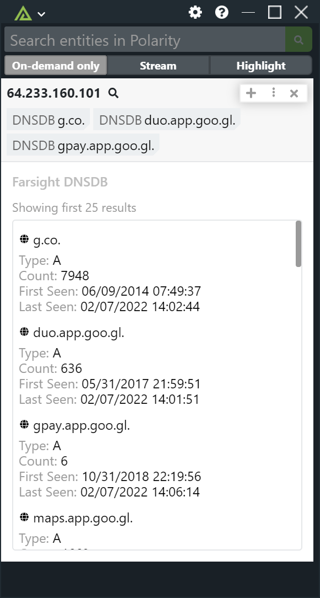
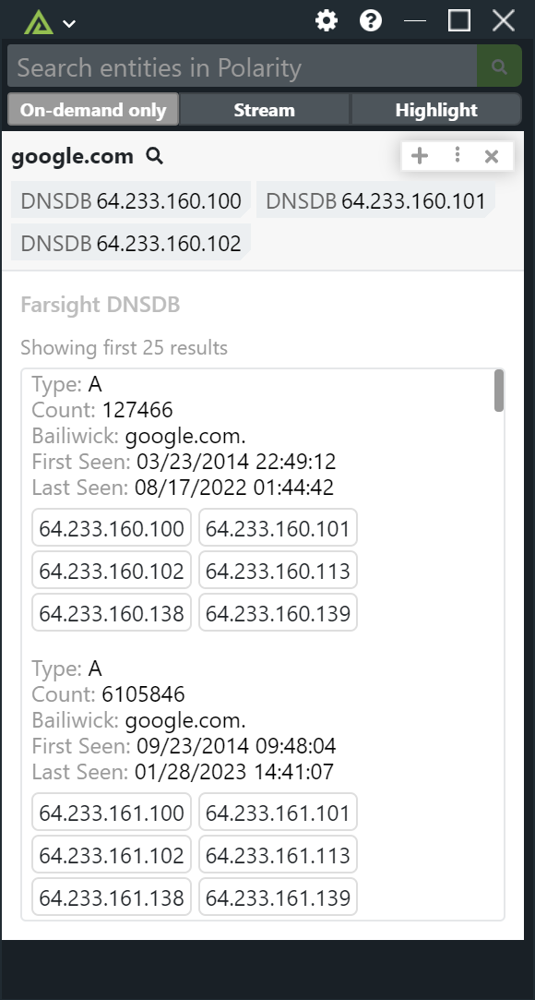

# Polarity Farsight DNSDB Integration

The Polarity Farsight DNSDH integration allows Polarity to search Farsight's API to return current and historical information about domains and IPs.  For more information about the Farsight DNSDB API please see https://api.dnsdb.info/

|  |  |
|---|---|
|*IP Lookup Example*|*Domain Lookup Example*|

## Farsight DNSDB Integration Options

### API Key

In order to use the DNDSDB API, you must have a valid DNSDB API key. Which will be provided to you after your purchase Farsight DNSDB. For more information on Farisght's DNSDB, please visit:

https://www.farsightsecurity.com/solutions/dnsdb/

### Ignored List

This is an alternate option that can be used to specify domains or IPs that you do not want sent to Farsight DNSDB. The data must specify the entire IP or domain to be blocked (e.g., www.google.com is treated differently than google.com).

### Lookup Limit

The maximum number of results to return per IP or Domain lookup.

### Maximum Number of Tags to Display

The maximum number of unique summary tags to display in the notification overlay

### Time Last After

Filters out results where the last seen time is after the given time. The parameters expects an integer (Unix/Epoch time) with seconds granularity or a relative time in seconds (preceded by -). The default is to return results within the last year.

### Lookup Options

Each user has the ability to determine if they want to lookup IPs or Domains.

## Installation Instructions

Installation instructions for integrations are provided on the [PolarityIO GitHub Page](https://polarityio.github.io/).

## Polarity

Polarity is a memory-augmentation platform that improves and accelerates analyst decision making.  For more information about the Polarity platform please see:

https://polarity.io/
